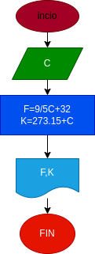

# Ejercicio No.2

## programa para convertir una cantidad de grados centígrados en su equivalente a kelvin y fahrenheit

# analisis

variables de entrada (input)

c:grados centigrados 

varibles de proceso y salida (precesing,estorage,output)

k:grado kelvin 
f:grados fahrenheit

# Diseño

# Construccion 